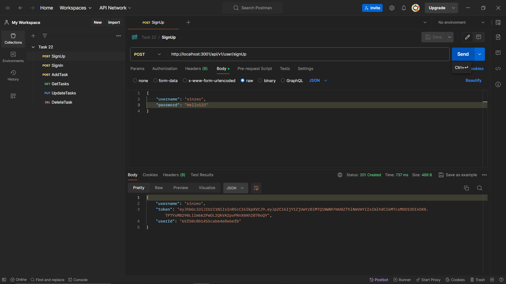
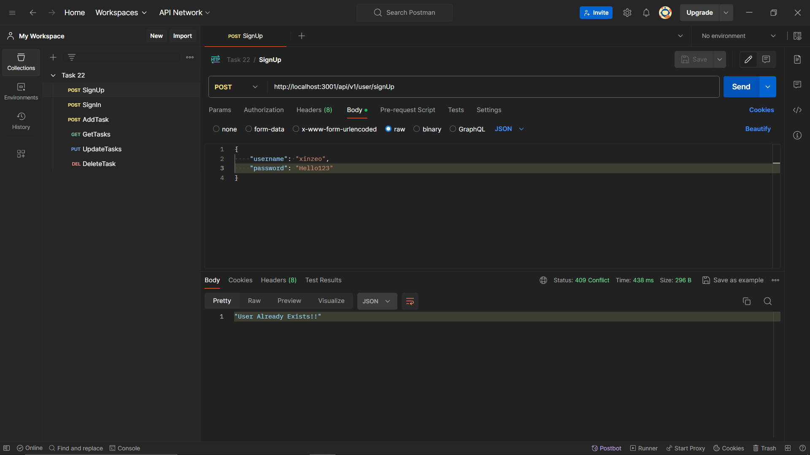
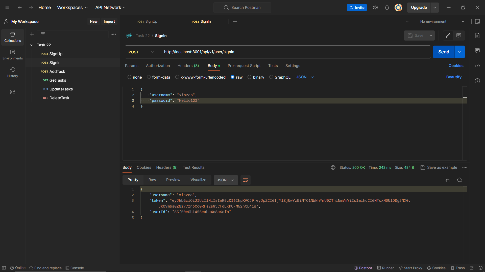
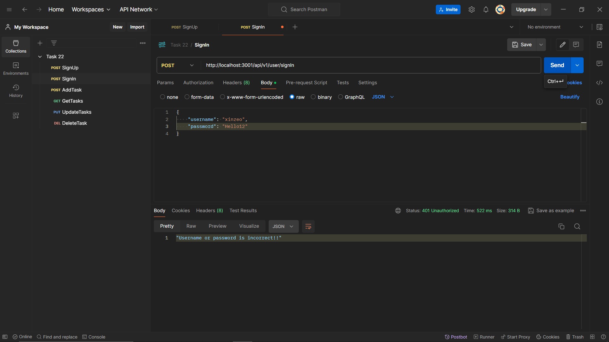
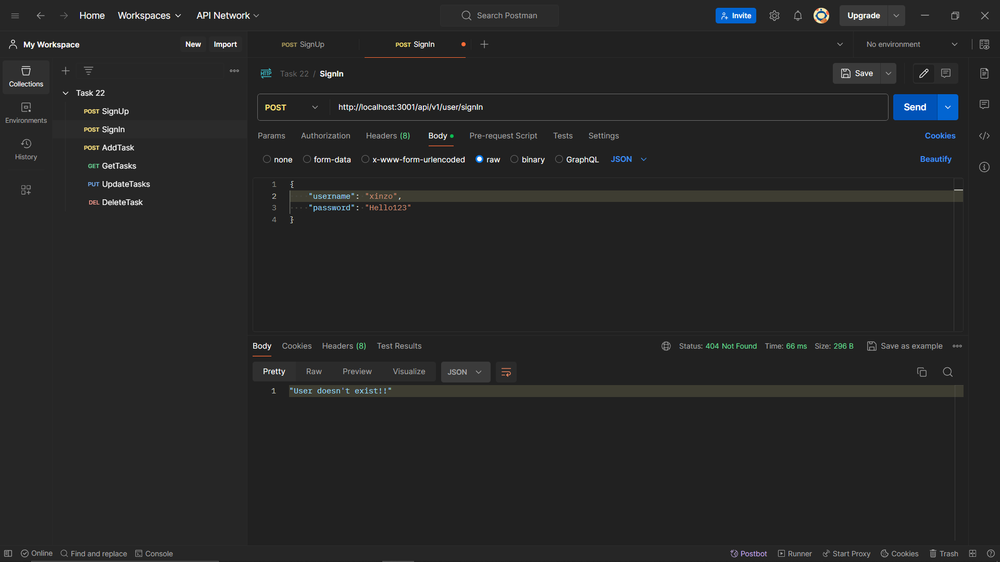
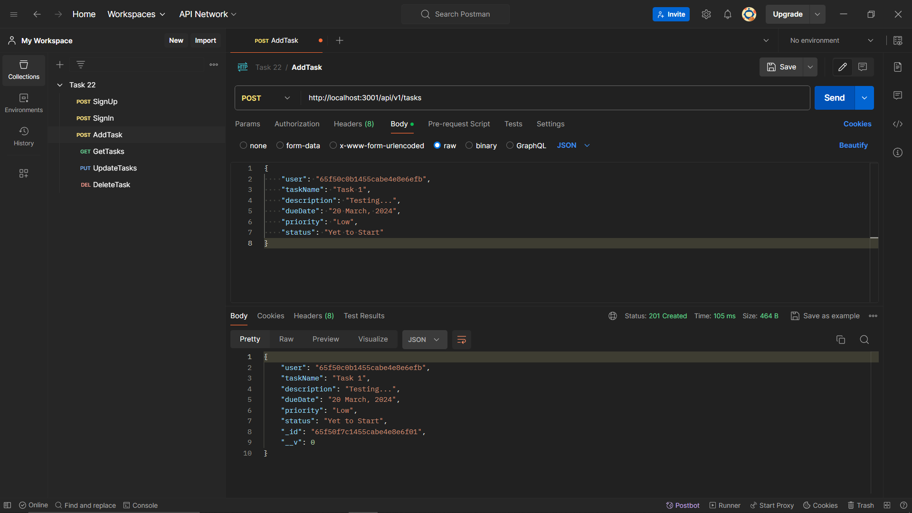
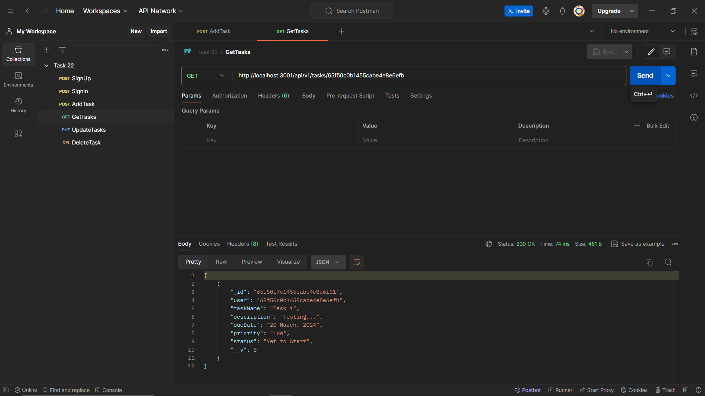
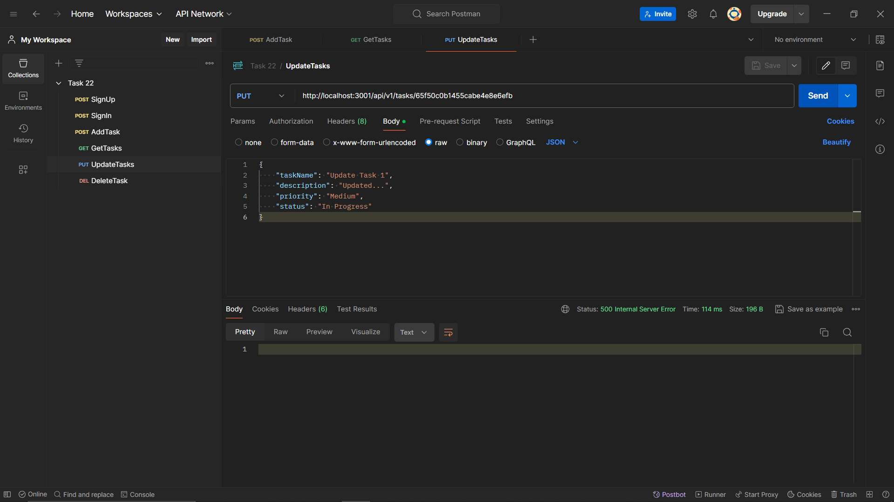
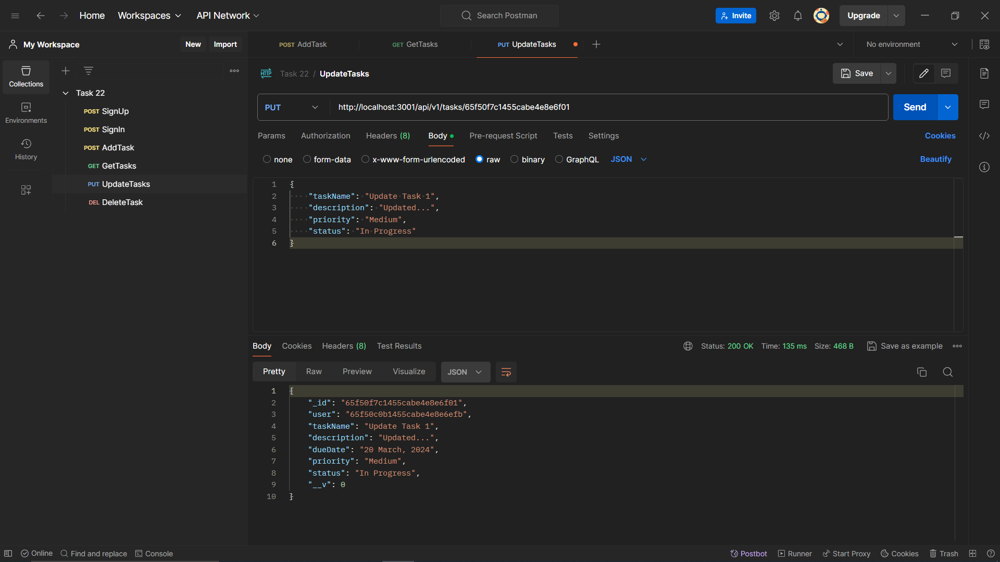
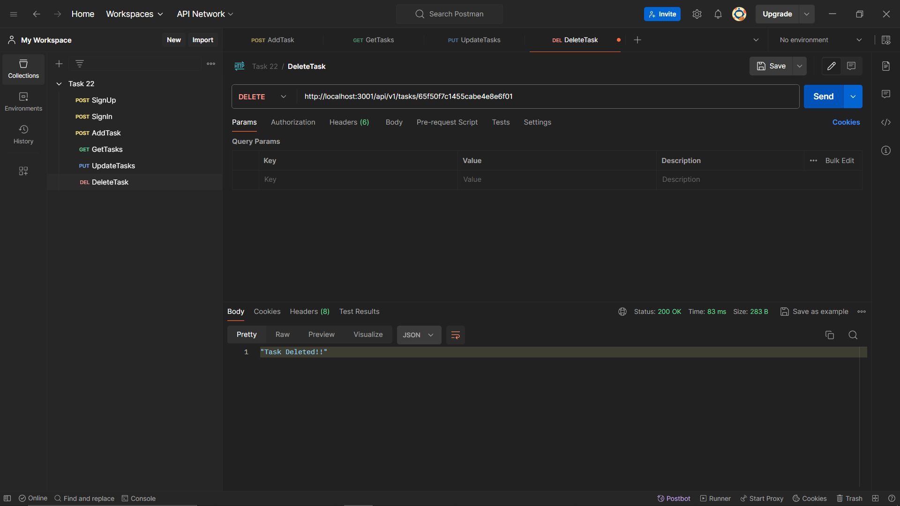

# Task 22
Integrating To-Do List APIs with React Frontend...
Use "cd server" then "npm i" and "npm run dev" to start the server!!
Use "cd client" then "npm i" and "npm run dev" to start the react application!!

The below screenshots are the results from postman for the tested APIs...

